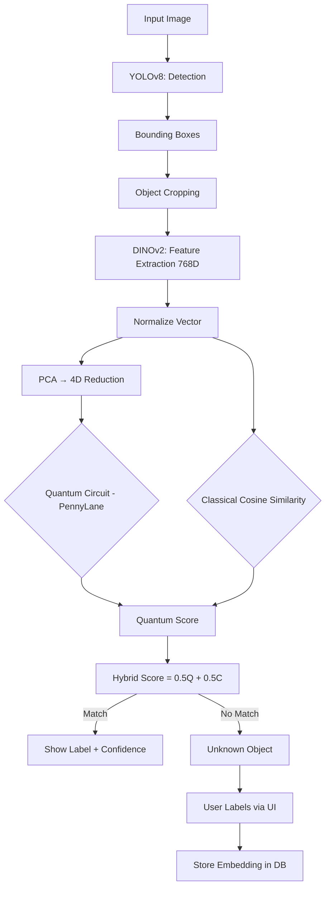

# 🛡️ CodeNova: Adaptive Object Recognition System

### *Empowering Vision with Dynamic Real-Time Learning*

[](#architecture)
[](#license)
[](#tech-stack)
[](#quantum-enhancement)

---

## 🚀 The Vision

Traditional object detection systems require **expensive retraining** or **fine-tuning** every time a new object needs to be recognized. This project breaks that barrier.

By combining **State-of-the-Art Object Detection (YOLOv8)** with **Foundation Model Embeddings (DINOv2)**, **Sub-millisecond Vector Retrieval**, and a **Quantum Machine Learning similarity engine**, we've built a system that learns new objects through a simple conversation — **zero retraining required**.

---

## 🛠️ System Architecture

Our architecture follows a modular, dual-stage pipeline that separates *Localization* from *Identification*.



---

## ✨ Key Features

- **🧠 Open-World Recognition**: Add new objects dynamically without touching a single line of training code.
- **⚡ Industrial YOLOv8 Detection**: Lightning-fast bounding box detection on any image.
- **👁️ DINOv2 Semantic Embeddings**: Extremely robust 768-dimensional feature vectors from Meta's foundation model.
- **⚛️ Quantum-Hybrid Similarity**: PennyLane 4-qubit circuit combined with classical cosine scoring for enhanced recognition.
- **🎙️ Voice Notifications**: Non-blocking TTS system announces detected objects in the background.
- **📈 Instant Learning**: New embeddings are stored in a dictionary-based database (`database.pkl`) and are immediately searchable.

---

## 🏗️ Technical Implementation

### 1. Detection (YOLOv8)
Locates objects in the image. Provides precise bounding boxes. Acts as the "eyes" that find *where* objects are.

### 2. Feature Extraction (DINOv2 via HuggingFace)
Each detected crop is passed through Meta's `facebook/dinov2-base`. Produces a 768-dimensional semantic embedding that captures the essence of an object.

### 3. Quantum-Hybrid Similarity (PennyLane)
```
Pipeline: Normalize(768D) → PCA(4D) → AngleEmbedding
Circuit:  Encode(query) · Adjoint(Encode(db_vec)) → P(|0000⟩)
Score:    0.5 × quantum_prob + 0.5 × cosine_similarity
```

### 4. Dynamic Learning
When an unknown object is detected:
1. User provides a label via the Streamlit UI.
2. The cached DINOv2 embedding is instantly stored in the database.
3. Next time the object appears, it's recognized immediately.

---

## 📂 Project Structure

```text
CodeNova/
├── app.py                  # Streamlit UI (main app)
├── detect.py               # YOLOv8 wrapper
├── embed.py                # DINOv2 feature extractor
├── database.py             # Embedding storage & hybrid search
├── learn.py                # Instant learning logic
├── voice.py                # Non-blocking TTS engine
├── src/
│   └── quantum_similarity.py  # ⚛️ NEW: Quantum-hybrid similarity
├── data/
│   └── database.pkl        # Persisted vector database
├── .streamlit/
│   └── config.toml         # Streamlit server config
└── requirements.txt        # Project dependencies
```

---

## 🚥 Getting Started

### Prerequisites
- Python 3.9+
- CPU (CUDA optional but not required)

### Installation

```bash
git clone https://github.com/yourusername/codenova.git
cd codenova
pip install -r requirements.txt
```

### Run
```bash
streamlit run app.py
```

---

## ⚛️ Quantum Enhancement

The `src/quantum_similarity.py` module implements a **4-qubit PennyLane circuit**:

| Step | Operation |
|---|---|
| **Reduce** | PCA compresses 768D → 4D |
| **Encode Query** | `AngleEmbedding(query, wires=[0,1,2,3])` |
| **Encode DB** | `Adjoint(AngleEmbedding)(db_vec, wires=[0,1,2,3])` |
| **Measure** | `probs(wires)` — P(|0000⟩) = overlap = quantum score |
| **Blend** | `final = 0.5 × quantum + 0.5 × cosine` |

> **Safety**: If PennyLane fails for any reason, the system **automatically falls back** to classical cosine similarity. Zero crashes guaranteed.

---

## 🔮 Future Roadmap

- [ ] Integration with **Segment Anything Model (SAM)** for pixel-perfect cropping.
- [ ] Cloud-sync for vector databases across edge devices.
- [ ] Support for **Multimodal LLMs** for automatic object description.
- [ ] Expand to **8–16 qubits** for higher-dimensional quantum encoding.
